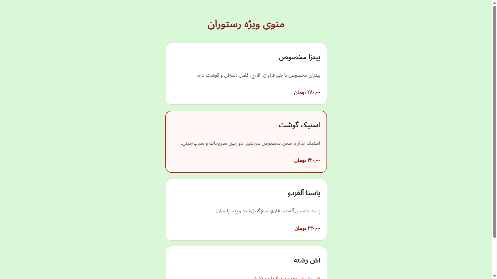

# HTML & CSS Restaurant Template

A clean and responsive restaurant website template built using HTML5 and CSS3.

## Overview
This project is a frontend portfolio sample created to demonstrate layout structure, styling, and responsive design skills.

## Features
- Responsive layout
- Clean and modern design
- Well-structured sections
- Simple navigation
- Portfolio-ready codebase

## Technologies Used
- HTML5
- CSS3

## Preview

## How to Run
Open `index.html` in your browser.

## Author
Salimi
